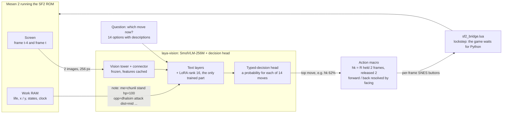
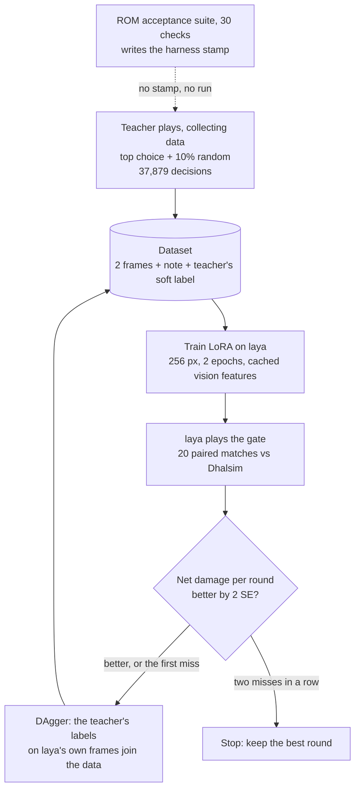
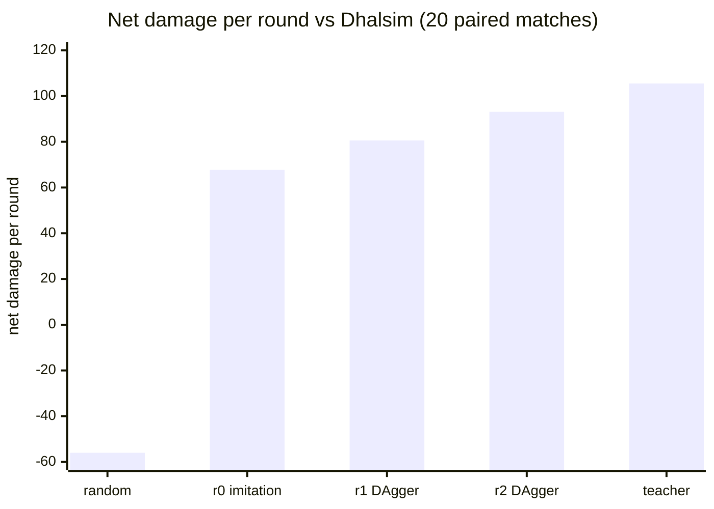

# laya-vision vs Street Fighter II: lessons learned

[](https://youtu.be/8VLMJVLKQAY)

*A 256M-parameter vision model looks at two screenshots and picks Chun-Li's next move, once every 4 frames. It wins
40 of 41 rounds against Dhalsim. Code: [github.com/beefkknd/laya_vision-vs-SF2](https://github.com/beefkknd/laya_vision-vs-SF2).*

I don't expect anyone to run this: you need the ROM, Mesen and an Apple-silicon Mac. This page is the part worth
reading: what went wrong, and how each problem was found and fixed. Setup is in [docs/SETUP.md](docs/SETUP.md) and
the agent runbook in [AGENTS.md](AGENTS.md).

## Why

I wanted to learn two things by doing them:

1. **Fine-tune a small model to solve a visual problem.** A "System 1" decision: one look at the screen, one
   choice, no reasoning chain. A fighting game is a good test, because the answer changes every quarter second and
   you can't fake it.
2. **Build the harness that makes tuning possible.** Understand the problem domain well enough to measure it, then
   gate every change on real play, like a regression test.

The second turned out to be most of the work, and all of the value.

## What laya-vision is

[laya-vision](https://github.com/r33drichards/laya-vision) is a research fork of Laya's typed-decision model. It
puts a **SmolVLM-256M** image backbone in front of a decision head that answers `predict(state, questions)` with a
probability for each option. It's PyTorch and runs on Apple MPS. The [base checkpoint](https://huggingface.co/thaitea/laya-vision-smolvlm-256m)
was trained on photo questions and knows nothing about games.

Here the question is "which of these 14 moves now?" The state is two frames (4 frames ago and now) plus a
one-line note read from RAM:

```
me=chunli stand hp=100 opp=dhalsim attack hp=100 dist=mid facing=right corner=none time=early last=forward fireball=none
```

Upstream has no LoRA, so `sf2/lora.py` adds rank-16 adapters to the text layers and merges them back after training.
A trained run is an ordinary laya-vision checkpoint.

## How it's wired

### One decision: from the screen to the buttons

Every 4 frames the emulator stops and waits. laya looks, picks a move, and the move becomes exact per-frame
button presses.



### The training loop

A scripted teacher reads RAM and labels every frame with a soft distribution over moves, whoever is playing.
laya first copies the teacher's own play (imitation). Then it plays, and the teacher labels **laya's own** frames
(DAgger). Every round is judged by the gate, never by training loss.



Each round moved laya closer to its teacher:



| Policy | Net damage / round (± SE) | Rounds won |
|---|---:|---:|
| random | −56.0 ± 7.4 | 3 / 42 |
| scripted teacher | +105.5 ± 6.8 | 40 / 40 |
| laya r0: imitation only | +67.7 ± 12.1 | 39 / 49 |
| laya r1: DAgger round 1 | +80.6 ± 9.6 | 39 / 46 |
| **laya r2: DAgger round 2** | **+93.1 ± 8.3** | **40 / 41** |

## Problems I hit, and what solved them

### 1. The harness lied, and every early result was an artefact
My first training loop produced a model with 82% frame accuracy that played badly, and a teacher that was worse
than random. An audit by three separate agents (emulator, data, code) found four bugs:
- x was read from the camera scroll, so distance was meaningless;
- facing flipped mid-round, so "forward" walked away;
- time-overs were scored as draws with made-up damage;
- parallel workers replayed identical matches.

**Fix:**
- Delete the data.
- Record real ROM traces and replay them in tests.
- Add a ROM acceptance suite (30 checks) that writes a stamp. Collection and play **refuse to start** without a
  stamp matching the ROM, the RAM map and the harness code.
- Every later fix got a test that failed first.

### 2. The emulator and the model disagreed about time
- **Screenshots were stale.** Headless Mesen skips rendering frames, so a screenshot could lag the RAM by 0–3
  frames, differently every run. *Fix:* `--snes.disableFrameSkipping=true`.
- **Model latency changed the fight.** *Fix:* lockstep. The Lua bridge blocks at every input poll until Python
  sends the next command, so slow inference never changes what happens.

### 3. "Who won" is harder than it looks
Life bars drain for several frames after a hit, a KO blow wraps the life byte below zero, and a time-over zeroes
both bars about 480 frames later. *Fix:* stop inferring and read the ROM's own round-result byte. Damage is booked
from the true-life byte on the frame the hit lands.

### 4. Not every frame is a decision
While she is being hit, thrown or knocked down, the stick does nothing, so labels on those frames are noise.
*Fix:* a `controllable` flag keeps those frames in the score but out of training. Block stun had to be told apart
from hit stun (holding down still works in block stun) with a separate reaction byte.

### 5. Measurement noise hides real progress
Per-round damage varies by about 30 points (standard deviation). *Fix:* one gate for everything:
- 20 **paired** matches (the same 20 openings for every arm);
- net damage per round as the primary number;
- "better" only if the gain exceeds 2 combined standard errors.

Frame accuracy and validation loss **did not** predict play strength, which upstream had also found on Atari.

### 6. The teacher was the bottleneck
Rules went in one at a time, and almost every one had to pass the gate to stay:

| Rule | Effect |
|---|---|
| Jump in from mid range | better than random |
| Kick **near the top** of the jump | hits 69% of the time just before the apex, vs 11% kicking on the way up |
| Crouch-guard his attacks | teacher reached +62.0 |
| Walk in and **throw** | teacher reached +104.5, 40/40 rounds |
| Fierce punch for close anti-airs | +105.5; kept even though the gain was below the bar |

Rules for fancier moves (sweep, Lightning Legs) failed the gate and were left out.

One surprise: **how the teacher plays while collecting matters as much as its rules.** Sampling its soft
distribution played at about +12. Its top choice plus 10% random played at +91 (+102 with 5% random)
and made far better data.

### 7. Imitation copies the wrong thing
r0 learned "repeat my last move": 94% of its mistakes repeated the previous action, and 17% of all its decisions
were such mistakes. One **DAgger** round cut that to 5%, because the teacher labelled the situations laya itself
got into.

### 8. Speed, measured and not assumed

| Change | Result |
|---|---|
| Cache the frozen vision tower's features per image | 2.4× faster training steps; LoRA only trains the text layers, so the features never change |
| 256 px instead of 512 | 1.34× faster training, 1.9× faster play |
| bf16 on MPS | rejected: 10% faster play, but only 69% agreement with fp32 |
| N headless Mesens in parallel | 4 play workers ≈ 20 decisions/s on an M4 Pro, 27 on an M4 Max |

### 9. Moving machines exposed hidden assumptions
When I moved from the Mac mini to a Mac Pro:
- **The feature cache broke on copied data.** It indexed images by absolute path. *Fix:* key them relative to the
  data dir, with a test that moves a data dir first.
- **Mesen died silently from a background shell.** A locked screen reports zero displays, and the GUI crashes.
- **The same benchmarks, re-run, changed the worker counts:**

  | Workers | Mac mini (M4 Pro) | Mac Pro (M4 Max) |
  |---|---|---|
  | Teacher-data collection | not re-measured | 12, about 390 decisions/s |
  | Student play | 4 | 4 |

### 10. Playing the real game, not a savestate
For the video, laya plays arcade mode from power-on: boot, menus, next opponent, bonus stages, continues.
- **The menus.** A fixed input script from reset reaches the same fight every time, because the ROM is
  deterministic.
- **Where you are in the game.** Screen and mode bytes in RAM say whether a fight is ready.
- **Three windows playing the same fight.** A model that always takes its top move plays identical fights. *Fix:*
  a different start delay per game.

## What I'd tell someone trying something similar
- **Build the measuring instrument before the model.** Test the harness against the real system, and make the
  pipeline refuse to run on an unverified one.
- **Pick one gate that measures the real goal,** size it to its noise, and never read progress off training loss.
- **Improve the teacher before scaling data.** When the gate stalls, the labels are usually too coarse.
- **Use DAgger once imitation plateaus.** It fixes exactly the states the student reaches that the teacher never did.
- **Measure speed on your own hardware.** Two Macs gave different answers.

## Still open
- **It only knows Dhalsim.** Every gate is against Dhalsim. In short arcade runs it has both beaten and lost to
  Ryu. Next is gating it against each opponent, then training across all of them.
- **Not quite real time:** about 72 ms per decision against a 67 ms budget on the M4 Pro.

## Repo map

| What | Where |
|---|---|
| Emulator bridge | `mesen/sf2_bridge.lua`, `sf2/mesen.py` |
| Environment, RAM map, actions | `sf2/env.py`, `ram_maps/sf2_snes.txt`, `sf2/actions.py` |
| Teacher | `sf2/teacher.py`, [TEACHER.md](TEACHER.md) |
| Training (LoRA, feature cache) | `scripts/train.py`, `sf2/lora.py`, `sf2/vision_cache.py` |
| Gate protocol and every number | [PROGRESS.md](PROGRESS.md) |
| The two-day story | [JOURNAL.md](JOURNAL.md) |
| Arcade console (the video) | `scripts/arcade.sh`, `scripts/show.py`, `sf2/boot.py` |
| Harness tests | `tests/test_rom_harness.py` |
